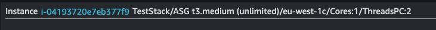

# Developing

## Important concepts

- `lib/config.json` is used to configure the project.
- `data/resource_collector.py` generates a configuration file (the filename is configurable in `lib/config.json`)
- We start with getting all tagged resources from the resource groups and tagging API. Each of these resources are represented by an JSON object that contains ARN with all tags. This is bare minimum that is needed.
- `data/resource_collector.py` can be used to decorate a resource object if CloudWatch requires multiple dimensions or if we want to provide additional data in the dashboard, by querying respective service API directly. (see decorator functions in the `data/resource_collector.py`).
- `sortARNsByService()` in `lib/services/graphfactory.ts` sorts resources into a map by region and service so that widgets are grouped in more natural way by service.
- `generate()` is called after sorting to generate widgets in order.
- Some services are broken out in separate dashboards to offload the main dashboard. For example EC2, Networking, Edge services
- A CloudWatch dashboard is a grid that is 24 units wide. This will be an important knowledge when implementing dashboards.

## Quick start (Implementing support for new service)

### Step 1 - sorting the service resources

1. In `lib/services/graphfactory.ts` and function `sortARNsByServce()` implement sorting of the resource. Sorting is done into `serviceArray`-multidimensional array. Format of the array is serviceArray[region][servicename]. Each resource can be represented as minimum a string (the ARN of the resource) but it can also be an JSON object. It's up to you to decide how you represent your resource as long as you
handle that format in your WidgetSet-implementation.
<details><summary>Example of `serviceArray` format with multiple services and regions:</summary>

```
[
  'eu-west-1': [
    apigatewayv2: [ [Object], [Object], [Object] ],
    apigatewayv1: [ [Object], [Object], [Object], [Object] ],
    dynamodb: [ [Object] ],
    ec2instances: [
      [Object], [Object],
      [Object], [Object],
      [Object], [Object],
      [Object], [Object],
      [Object], [Object],
      [Object]
    ],
    ecs: [ [Object], [Object], [Object] ],
    elbv2: [ [Object], [Object] ],
    odcr: [ [Object] ],
    lambda: [ [Object], [Object], [Object], [Object] ],
    sns: [ [Object] ],
    tgw: [ [Object] ],
    wafv2: [ [Object] ],
    natgw: [ [Object] ],
    elbv1: [ [Object] ],
    aurora: [ [Object], [Object] ],
    sqs: [ 'arn:aws:sqs:eu-west-1:123456789012:IEM-Queue' ],
    autoscalinggroup: [
      'arn:aws:autoscaling:eu-west-1:123456789012:autoScalingGroup:ed296d0c-a26f-489e-b479-f1cd5c6aa2a8:autoScalingGroupName/TestAuto',
      'arn:aws:autoscaling:eu-west-1:123456789012:autoScalingGroup:40c71915-713e-4bd5-ab6b-d1cb3037524f:autoScalingGroupName/TestStack-ASG46ED3070-1Q6Y1MXNGEUTB'
    ]
  ],
  global: [ cloudfront: [ [Object] ] ],
  'us-east-1': [
    sqs: [ 'arn:aws:sqs:us-east-1:123456789012:OrderQueue' ],
    apigatewayv1: [ [Object] ],
    lambda: [ [Object], [Object] ]
  ]
]
```

</details>
<details><summary>Example of code to add to `sortARNsByService()`:</summary>
Consider the ARN of a loadbalancer "arn:aws:elasticloadbalancing:eu-west-1:123456789012:loadbalancer/ZZZZ". We could simply probe for "elasticloadbalancing" in the ARN but that's not enough. Both V1 and V2 ELBs have "elasticloadbalancing" in the ARN. On top of that even target groups have the same string in the ARN.
In this particular scenario it's advisable to distinguish whether an ELB is Classic Load Balancer (V1) or Network Load Balancer (V2) or Application Load Balancer (V2). 
Consider also that we are using ":elasticloadbalancing:" instead of only "elasticloadbalancing" to better match the ARN and avoid scenarios where a resource of different service 
with a name "elasticloadbalancing" would be wrongfully identified as ELB. Here we know it's a V1 ELB because it has the searched string and does not have "/net/" or "/app/".

Below we also named the service "elbv1". You can name your service what ever you like. You will use this to trigger your widget set processing.

```typescript
...} else if ( resource.ResourceARN.includes(':elasticloadbalancing:') && ! resource.ResourceARN.includes('/net/') && ! resource.ResourceARN.includes('/app/') && ! resource.ResourceARN.includes(':targetgroup/')){
    if (!this.serviceArray[region]["elbv1"]){
        this.serviceArray[region]["elbv1"] = [resource];
    } else {
        this.serviceArray[region]["elbv1"].push(resource);
    }
}

```

</details>

### Step 2 - implementing the widgets (using WidgetSet)

2. Implement a widget set generator. A widget set is basically a set of widgets that contains all widgets for one single resource on your dashboard. To implement a widget set, simply create a file in `lib/services/servicewidgetsets`, give it a
meaningful name and "extend" Construct class and "implement" WidgetSet interface. (see classes in `lib/services/servicewidgetsets` for some inspiration). Normally you will pass the resource to the class via the constructor. In the constructor, you will process the resource and generate the appropriate widgets.
Here will you determine how you handle the resource. Remember it can be only an ARN or a decorated object. If you do have a decorated object with additional information, here is an opportunity to create a text widget and present that information.
See how it's done in `lib/services/servicewidgetsets/ec2instances.ts`.
<details><summary>Here is an example:</summary>

```typescript
    constructor(scope: Construct, id: string, resource:any, config:any) {
        super(scope, id);

        /***
         * Here we want to collect some parameters to show on the dashboard, like instance id, instance type and also whether it's burstable or not. We want to add widgets for CPUCredits only on burstable instances (adding only relevant information).
         ***/

        const instanceId = resource.ResourceARN.split('/')[resource.ResourceARN.split('/').length - 1];
        const region = resource.ResourceARN.split(':')[3];
        const instanceType = resource.Instance.InstanceType;
        let burstable = false;
        let burstmodeLabel = ''
        if ( instanceType.match('t[2-9]')){
            burstable = true;
            burstmodeLabel = ` (${resource.CPUCreditSpecs.CpuCredits})`; //If it's burstable we know we have info about the burst mode in the decorated object
        }
        const instanceAz = resource.Instance.Placement.AvailabilityZone; //we want to show az on the dasboard so it's easily accessible
        const coreCount = resource.Instance.CpuOptions.CoreCount; //we can show core count so why wouldn't we.
        const threadsPerCore = resource.Instance.CpuOptions.ThreadsPerCore; //also threads per core could be interesting
        let instanceName = '';
        if ( resource.Tags ){
            for ( let nameTag of resource.Tags ){
                if ( nameTag.Key === "Name" ){
                    instanceName = nameTag.Value;
                }
            }
        }

        /***
         * Auxdata is about being able to configure (in lib/config.json) an arbitrary tag keys that, if present on an EC2 instace, will show on the dashboard
         * ***/
        let auxdata = ""
        if ( config.CustomEC2TagKeys && config.CustomEC2TagKeys.length > 0){
            let tags = resource.Tags;
            for ( const tag of tags ){
                if ( config.CustomEC2TagKeys.indexOf(tag.Key) > -1 ){
                    auxdata += ` ${tag.Key}=${tag.Value}`
                }
            }
        }


        /***
         * And here it is where all comes together where the markDown is constructed with the variables and additional information. See screenshot below how it can look.
         * ***/
        let markDown = `### Instance${auxdata} [${instanceId}](https://${region}.console.aws.amazon.com/ec2/v2/home?region=${region}#InstanceDetails:instanceId=${instanceId}) ${instanceName} ${instanceType}${burstmodeLabel}/${instanceAz}/Cores:${coreCount}/ThreadsPC:${threadsPerCore}`
        this.widgetSet.push(new TextWidget({
            markdown: markDown,
            width: 24,
            height: 1
        }))
```

Here is how it looks:



</details>

Do consider, when creating widgets for a resource, that you fill full length rows (24 column units) on the dashboard. For example, if your widget set generator generates only 3 widgets that are 6 units wide, it will not fill the full row but only 18 units with 6 units empty and the next resource
will start "tiling" to complete the row (Like Tetris but from below :)). Therefore, it's ideal to ensure that you utilise at least a full row for a single resource. Once your widgets are created, inject them into widgetArray property of your class. If you created any alarms those go into alarmSet property.

### Step 3 - integrating the WidgetSet in the GraphFactory

3. When you have implemented your WidgetSet it's time to use it in `lib/graphfactory.ts` and generate the widgets. In `generate()` add your code to the switch-statement. There is a loop that goes through each of the configured regions and iterates through all services in the `serviceArray`. The switch statement will receive a service key and when you match that service key in your case you can retrieve all the resources with that service name.
   See below how API Gateway is implemented:

```typescript
case "apigatewayv1": {
    this.widgetArray.push(new TextWidget({
        markdown: "## API Gateway V1 (REST)",
        width: 24,
        height: 1
    }))
    for (const resource of this.serviceArray[region][servicekey]) {
        let apiid = resource.ResourceARN.split('/')[resource.ResourceARN.split('/').length - 1]
        let apigw = new ApiGatewayV1WidgetSet(this, `APIGWV1WidgetSet-${apiid}-${region}`, resource);
        for (const widgetSet of apigw.getWidgetSets()) {
            this.widgetArray.push(widgetSet);
        }
        this.alarmSet = this.alarmSet.concat(apigw.getAlarmSet());
    }
    break;
}
```
