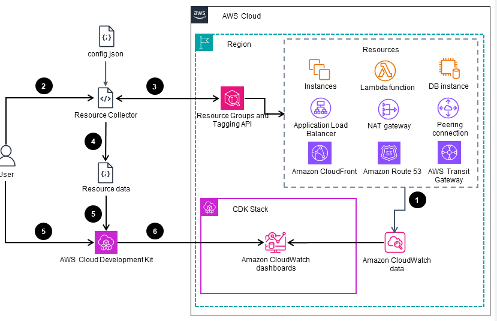
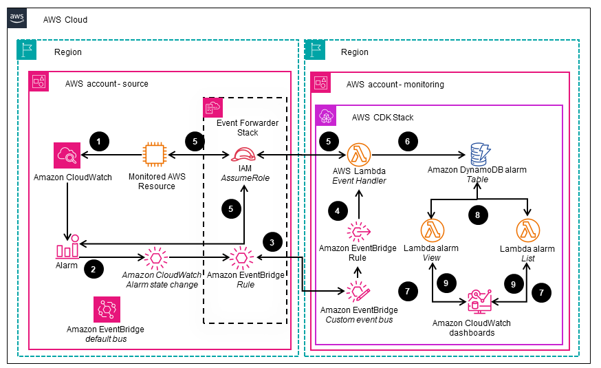

# Guidance for Network Monitoring and Alerting Automation on AWS

## Table of Contents

1. [Overview](#overview)
  - [Architecture](#architecture)
  - [Cost](#cost)
2. [Prerequisites](#prerequisites)
  - [Operating System](#operating-system)
  - [Third-Party Tools](#third-party-tools)
3. [Deployment Steps](#deployment-steps)
4. [Deployment Validation](#deployment-validation)
5. [Running the Guidance](#running-the-guidance)
6. [Next Steps](#next-steps)
7. [Cleanup](#cleanup)

## Overview

The project is an example of how to use [AWS Resource Groups Tagging API](https://docs.aws.amazon.com/resourcegroupstagging/latest/APIReference/overview.html) to retrieve a specific tag and then based on found resources pull additional information from respective service APIs to generate a configuration file (JSON) to build a CloudWatch Dashboard with \_reasonable_ metrics and alarms. Optionally users
can also deploy a central alarm dashboard to monitor alarms across their AWS Organization, AWS Organization OU or arbitrary number of AWS accounts.

### Architecture

_Figure 1: High level Deployment automation process for the Guidance_

1. A group of AWS Cloud resources continuously store related metrics in the [Amazon CloudWatch](https://aws-preview.aka.amazon.com/cloudwatch/) data store.
2. The user initiates the `Guidance Resource Collector` script that uses the config file.
3. The Guidance Resource Collector fetches resources matching the config file from the [AWS Resource Groups Tagging API Reference](https://docs.aws.amazon.com/resourcegroupstagging/latest/APIReference/overview.html).
4. The Guidance Resource Collector saves resource data in a JSON file.
5. The user initiates the [AWS Cloud Development Kit (AWS CDK)](https://aws-preview.aka.amazon.com/cdk/) to synthesize an [AWS CloudFormation](https://aws-preview.aka.amazon.com/cloudformation/) template. The CloudFormation template is using AWS monitoring best practices.

_Figure 2: Deployment automation to generate and deploy the "Event Forwarder Stack" required for configuring the AWS accounts where the resources being monitored reside_

1. The user runs the `cdk deploy` command to generate the CloudFormation template and deploy the infrastructure within the designated “monitoring” account.
2. The user records the output of the deployment, which contains the [Amazon Resource Names (ARNs)](https://docs.aws.amazon.com/IAM/latest/UserGuide/reference-arns.html) of the central custom [Amazon EventBridge](https://aws-preview.aka.amazon.com/eventbridge/) event bus and the [AWS Lambda](https://aws-preview.aka.amazon.com/lambda/) function execution role.
3. The user provides the ARNs obtained from the previous step to generate the CloudFormation template for the `Event Forwarder Stack` which is required for configuring the source accounts.
4. The user deploys the CloudFormation template for the `Event Forwarder Stack` to the intended source accounts, either individually or across multiple accounts and Regions, using CloudFormation [StackSets](https://docs.aws.amazon.com/AWSCloudFormation/latest/UserGuide/what-is-cfnstacksets.html).

_Figure 3: Flow of events when a CloudWatch alert is triggered and processed by AWS Lambda functions_

1. An AWS Cloud resource sends a metric that breaches a threshold defined in a CloudWatch alarm.
2. When the alarm is triggered, CloudWatch emits a “CloudWatch Alarm State Change” event on the EventBridge default bus within the respective account.
3. An EventBridge Rule on the default bus forwards the event to the central custom EventBridge event bus.
4. An EventBridge Rule defined within the central event bus dispatches the event to the ”Event Handler” Lambda function that analyzes the event
5. The ”Event Handler” Lambda function assumes an [AWS Identity and Access Management(IAM) role](https://aws-preview.aka.amazon.com/iam/) that has been deployed by the “Event Forwarder” CloudFormation stack set in the source account. It then queries the monitored resource and the CloudWatch alarm for additional details
6. The “Event Handler” Lambda function consolidates the additional details with the event and stores the combined information in an [Amazon DynamoDB](https://aws-preview.aka.amazon.com/dynamodb/) alarms table.
7. The CloudWatch dashboard, which includes custom CloudWatch widgets, triggers the execution of two Lambda functions—"View" and "List" — upon each dashboard would refresh.
8. The “View” and “List” Lambda functions retrieve and filter the alarm data, then generate HTML code for rendering within the respective CloudWatch custom widgets.
9. The “View” and “List” Lambda functions return the HTML code to the CloudWatch widgets, which then render it, including the relevant metrics, on the CloudWatch user interface.

### Supported services for monitoring

| **AWS Service**                | **Description**                                 |
|--------------------------------------------------------------------------------------------------------------------------------------------------------|-------------------------------------------------|
| [Amazon API Gateway v1 (REST)](https://aws.amazon.com/api-gateway/)                                                                  | REST                                            |
| [Amazon API Gateway v2 (HTTP, WebSockets)](https://aws.amazon.com/api-gateway/)                                                     | HTTP                                            |
| [AWS AppSync](https://aws.amazon.com/appsync/)                                                                                      | Connect apps to data and events                 |
| [Amazon Aurora](https://aws.amazon.com/rds/aurora/)                                                                                 | RDS service                                     |
| [EC2 Auto Scaling groups](https://docs.aws.amazon.com/autoscaling/ec2/userguide/auto-scaling-groups.html)                           | EC2 auto-scaling                                |
| [On-Demand Capacity Reservations](https://docs.aws.amazon.com/AWSEC2/latest/UserGuide/ec2-capacity-reservations.html)               | On-demand capacity reservations                 |
| [Amazon CloudFront](https://aws.amazon.com/cloudfront/)                                                                             | Content delivery mechanism                      |
| [Amazon DynamoDB](https://aws.amazon.com/pm/dynamodb)                                                                               | Persistemt layer service                        |
| [Amazon Elastic Block Storage - EBS (as part of EC2)](https://aws.amazon.com/ebs)                                                   | Locally attached storage                        |
| [Amazon Elsatic Compute Cloud - EC2 (support for t\* burstable instances, support for CloudWatch Agent)](https://aws.amazon.com/ec2) | EC2 instances                                   |
| [Amazon Elastic Load Balancer - ELB v1 (ELB Classic)](https://aws.amazon.com/elasticloadbalancing/)                                 | Amazon ELastic Load Balancer                    |
| [ELB v2 (ALB, NLB)](https://aws.amazon.com/elasticloadbalancing/)                                                                   | Amazon Elastic Load Balancer                    |
| [Amazon Elastic Container Services - ECS (EC2 and Fargate)](https://aws.amazon.com/ecs/)                                            | Amazon Elastic Container Services               |
| [Amazon Elastic File Storage - EFS](https://aws.amazon.com/ecs/)                                                                    | Amazon Elastic File Storage                     |
| [AWS Lambda](https://aws.amazon.com/lambda/)                                                                                        | Lambda Function for event driven processing     |
| [AWS Elemental MediaLive](https://aws.amazon.com/medialive/)                                                                        | Video Encoding service                          |
| [AWS Elemental MediaPackage](https://aws.amazon.com/mediapackage/)                                                                  | Prpeare video for internet delivery             |
| [AWS NAT Gateway](https://docs.aws.amazon.com/vpc/latest/userguide/vpc-nat-gateway.html)                                            | NAT Gateway                                     |
| [Relational Database Service](https://aws.amazon.com/rds/)                                                                          | Relational Persistent layer service             |
| [AWS Simple Storage Servicde - S3](https://aws.amazon.com/s3/)                                                                      | Object Storage service                          |
| [AWS Simple Notification Service - SNS](https://aws.amazon.com/sns/)                                                                | Simple Notification Service                     |
| [AWS Simple Queue Service- SQS](https://aws.amazon.com/sqs/)                                                                        | Simple Queue Service                            |
| [AWS Transit Gateway](https://aws.amazon.com/transit-gateway/)                                                                      | Transit Gateway Connection                      |
| [AWS Web Application Firewall - WAF v2](https://docs.aws.amazon.com/waf/latest/APIReference/Welcome.html)                           | Web Application Firewall                        |
| [AWS Direct Connect](https://aws.amazon.com/directconnect/)                                                                         | Direct Connect Hosted and Dedicated connections |
| [AWS Network Firewall](https://aws.amazon.com/network-firewall/)                                                                    | Network Firewall                                |

This guidance focuses on automation of Network services monitoring  even though other AWS services listed above are supported by code as well.

### Central Alarm Dashboard features

- Event-driven for scalability and speed
- Supports arbitrary source accounts within an AWS Organization (different teams can have own dashboards)
- Supports automatic source account configuration through stack-sets
- Supports visualization and sorting of alarm priority (CRITICAL, MEDIUM, LOW) through alarm tags in source accounts.
  Simply add tag with key `priority` and values critical, medium or low.
- Supports tag data for EC2 instances in source accounts

### Cost

This contains of two distinct features. Metric Dashboards and Alarm Dashboard.

#### Metric Dashboards

The cost is mostly generated by the number of CloudWatch Dashboards in the account, where first three Dashboards are free, and the number of Alarms.
The guidance code will try to respect the best design practices, convenience of use and hard limits of CloudWatch (no more than 500 widgets per Dashboard) and create
additional Dashboards to place the widgets on. Some configuration parameters may cause more Dahsboards to be created, like `GroupingTagKey` or `Compact`-mode.

You can learn the estimated cost of the metric Dashboard deployment by running `cdk synth`. The code will construct the CloudFormation template and estimate the cost
based on number of Dashboards and Alarms generated without deploying it. Instead you will see the estimated cost on the screen.

These are the only cost drivers. Number of metrics or existing resources tagged do not affect the cost directly.

### Alarm Dashboard

The Alarm Dashboard is deployed as serverless and event driven architecture with on-demand cost model. There are two main drivers of cost:

1. **Alarms changing state** - As an alarm changes state, an event is emitted and workflow is triggered. The workflow will forward the event to a central monitoring account
   and execute a Lambda function that will look up more information about the resource monitored for additional context and lookup more information about the Alarm itself. Such as Alarm tags.
   This to be able to visualize "priority" of an Alarm. Then it will store that object into DynamoDB table. Cost drivers here are number of existing alarms and frequency at which they change state.

2. **Alarm Dashboard refreshing** - Depending on "refresh" setting of the Alarm Dashboard, the Dashboard will invoke the two Lambda functions that are part of the two CloudWatch custom widgets.
   The Lambda functions will fetch objects from the DynamoDB table and render HTML to display Alarms in alarm state and a list of Alarms. Cost drivers here are the refresh setting which drives the number of Lambda function invocations,
   object size and which drives the amount of DynamoDB Read Request Units. For the calculation below, the most pessimistic (expensive) settings were used for refresh (10s).

You are responsible for the cost of the AWS services used while running this guidance. As of April 2024, the cost for running this guidance with the default settings in the US East (N. Virginia) Region is approximately **\$1 per month**, assuming 3,000 transactions.

This guidance uses [Serverless services](https://aws.amazon.com/serverless/), which use a pay-for-value billing model. Costs are incurred with usage of the deployed resources. Refer to the [Sample cost table](#sample-cost-table) for a service-by-service cost breakdown.

We recommend creating a [budget](https://docs.aws.amazon.com/cost-management/latest/userguide/budgets-create.html) through [AWS Cost Explorer](http://aws.amazon.com/aws-cost-management/aws-cost-explorer/) to help manage costs. Prices are subject to change. For full details, refer to the pricing webpage for each AWS service used in this guidance.

### Sample Cost Table

The following table provides a sample cost breakdown for deploying this guidance with the default parameters in the `us-east-1` (US East - N. Virginia) Region for one month assuming "non-production" level metrics volume.

| **AWS service**                                                                      | Dimensions                                                                                               | Cost \[USD\] |
|--------------------------------------------------------------------------------------| -------------------------------------------------------------------------------------------------------- | ------------ |
| [Amazon CloudWatch](https://aws.amazon.com/cloudwatch/)           | 1 Charged dashboard                                                                                      | \$ 3.00      |
| [Amazon DynamoDB](https://aws.amazon.com/dynamodb/pricing/)       | 1Gb data storage, Standard table class on-demand capacity, 1 million writes/month, 2 million reads/month | \$ 3.00      |
| [AWS Lambda](https://aws.amazon.com/lambda/pricing/)              | 618 400 requests per month with 3000 ms avg duration, 256 MB memory, 512 MB ephemeral storage            | \$ 7.85      |
| [Amazon EventBridge](https://aws.amazon.com/eventbridge/pricing/) | 1 million custom events per month and 1 million cross region events                                      | \$ 2.00      |
| **Total estimated cost per month:**                                                  |                                                                                                          | **\$15.85**  |

A sample cost breakdown for production scale load (10 000 Alarms, each triggering 10 times a month) can be found in this [AWS Pricing Calculator estimate](https://calculator.aws/#/estimate?id=10b6390878f085cdc97d169543459d8b669103e6) and is estimated around **$15.85 USD/month**

## Prerequisites

### Operating System

Any operating system (Windows, Linux, MacOS X) that supports running Python 3 and NodeJS 18+.

These deployment instructions are optimized to best work on Amazon Linux 2023. Deployment in another OS may require additional steps.

For easiest and fastest deployment experience, we recommend running the deployment from [AWS CloudShell](https://aws.amazon.com/cloudshell/)

### Third-party tools

- Python 3 with boto3
- NodeJS 18+
- CDK V2 (`npm -g install aws-cdk@latest`)

### aws cdk bootstrap
This Guidance uses aws-cdk. If you are using aws-cdk for first time, please perform the below bootstrapping.

`cdk bootstrap`

See more here: (https://docs.aws.amazon.com/cdk/v2/guide/bootstrapping.html). 

In case you don't want to bootstrap read [Deploying without boostraping CDK](BOOTSTRAP.md).

## Deployment Steps

**Please refer to [FULL IMPLEMENTATION GUIDE](https://implementationguides.kits.eventoutfitters.aws.dev/nw-maa-0219/networking/network-monitoring-and-alerting-automation.html) for detailed instructions and deployment options.** 

### Getting and preparing the code

1. Check out the project. `git clone https://github.com/aws-samples/tag-based-cloudwatch-dashboard.git`
2. Change current directory to project directory. `cd tag-based-cloudwatch-dashboard`
3. Run `npm ci` to install dependencies.

### Configuring the dashboards
1. Open the configuration file `lib/config.json` in your editor of choice.
2. Set TagKey to tag key you want to use and TagValues to an array of values. Dashboard will collect all resources tagged
   with that key and the specified values.
3. Set Regions to include the regions that contain resources you want to monitor.
4. **OPTIONAL** if you want to deploy central alarm dashboard set `AlarmDashboard.enabled` to true and provide your AWS
   Organizations id in `AlarmDashboard.organizationId`.
5. **OPTIONAL** if you don't want to use metric dashboards you can disable creation of those by setting
   `MetricDashboards.enabled` to false. See _Configuration properties in lib/config.json_ above for more information.
6. **OPTIONAL:** Edit `BaseName`-property in `lib/config.json` to change the name of your dashboard and CloudFormation stack. In case you plan to deploy multiple sets of dashboards for different applications in the same account, ensure all subsequent deploys have different `BaseName`.
7. Save the configuration file.

### Deploying the dashboards

1. If the deployment of the metric dashboards have been enabled, run `cd data; python3 resource_collector.py` to create
   the resource configuration file (`resources.json` in the `data` directory).
2. Run `cd ..` to change directory to project root.
3. Run `cdk synth` to generate CF template or use `cdk deploy --all` to deploy directly to your AWS account.
4. In case central alarm dashboard is enabled in the configuration, take note of deployment output,
   `*.CustomEventBusArn` and `*.CustomDynamoDBFunctionRoleArn` and copy those ARNs to use in the next stage.

### Enabling source accounts to share alarms
_This only applies in case `AlarmDashboard.enabled` is set_

1. Run command `cd stack_sets` to change directory which contains `event_forwarder_template.yaml`.
2. Run command `sh create_stackset.sh ARN_OF_CUSTOM_EVENT_BUS ARN_OF_THE_LAMBDA_FUNCTION_ROLE_ARN`, replace the
   placeholder with the ARNs from the previous step.
3. Deploy the generated `event_forwarder.yaml`-template manually to each of the source accounts and each region you wish
   to enable through CloudFormation or deploy it automatically to an AWS Organization, OU or list of accounts through
   service managed stack-sets from your management account or stack-set delegate account.

### Monitoring alarms in "Management Account"

In case you have alarms in the AWS Organizations management account but are deploying the Alarm Dashboard in another
account, you will need to manually deploy `event_forwarder.yaml` in the management account in all regions that you want
to receive alarms from. This is because of that even if the `event_forwarder.yaml` is deployed as a managed stack set it
won't get deployed in the management account.

## Deployment Validation

1. Open CloudFormation console and verify the status of the template with the name starting with the ${BaseName}-Stack, where BaseName is value of BaseName in `lib/config.json`!
2. If AlarmDashboard was deployed check that stack with name ${BaseName}-Alarm-Stack exists!
3. Open CloudWatch console and click on Dashboards. Verify that you have a dashboard with name ${BaseName}-Dashboard!
4. If Alarm Dashboard was deployed, check that dashboard with name ${BaseName}-Alarm-Dashboard exists!
5. Validate that deployment is correct by observing metrics and alarms on the dashboard. (For alarms you might want to manually trigger an alarm using command: `aws cloudwatch set-alarm-state --alarm-name ${alarm} --state-value ALARM --state-reason testing --region=$region`)

## Running the Guidance

1. The Metric dashboard is a standard CloudWatch dashboard. Go to CloudWatch console, select Dashboards and click on the link to open it!
2. The Alarm Dashboard is serverless event-driven dashboard. You can access it through CloudWatch console as Metric Dashboards.

## Next Steps

1. Review [Configuration Options](#configuration-options) to customize your experience.
2. Review [Developing](DEVELOPING.md) to learn how to develop support for additional services or modify the existing implementation (for example Alarm thresholds)

## Cleanup

To delete this guidance run following command in the root of the project: `cdk destroy --all`.

## FAQ, known issues, additional considerations, and limitations

### Additional Considerations
- Alarm Dashboard is event driven. This means, that cross account/region alarms won't be visible unless they change state 
   and thus "auto-register". This is convenience and scalability feature. Side effect of that is that no alarms are visible 
   initially but appear as they are created or triggered.
- Alarm Dashboard is serverless cross account feature that uses IAM Roles to allow least privilege access. During the operation,
   a component of Alarm Dashboard will collect additional information, (describe-*, list-tags-*),about the affected resource to provide additional context. 
   Use IAM Access Analyzer to refine permissions if higher confidentiality is required.
- Use tags "priority" and values "critical", "medium" and "low", to set prioritization for Alarms when using Alarm Dashboard.

  
### Configuration options

`BaseName` (String:required) - Base-name of your dashboards. This will be the prefix of the dashboard names.

`ResourceFile` (String:required) - The path for the file where resources are stored. Used by the `resource_collector.py`
when generating resource config and by the CDK when generating the CF template.

`TagKey` (String:required) - Configuration of the tag key that will select resources to be included.

`TagValues` (Array<String>:required) - List of values of `TagKey` to include.

`Regions` (Array<String>:required) - List of regions from which resources are displayed.

`GroupingTagKey` (String:optional) - If set, separate Lambda and EC2 dashboards will be created for every value of that
tag. Every value groups resources by that value.

`CustomEC2TagKeys` (Array<String>:optional) - If set, the tag info will show in the EC2 header widget in format
Key:Value. Useful to add auxilary information to the header.

`CustomNamepsaceFile` (String:required) - Detected custom namespaces. Not yet used.

`Compact` (boolean (true/false):required) - When set to true, multiple Lambda functions will be put in a single widget
set. Useful when there are many Lambda functions.

`CompactMaxResourcesPerWidget` (Integer:required) - When `Compact` is set to true, determines how many Lambda functions
will be in each widget set.

`AlarmTopic` (String:optional) - When `AlarmTopic` contains a string with an ARN to a SNS topic, all alarms will be
created with an action to send notification to that SNS topic.

`MaxWidgetsPerDashboard` (Integer:optional) - When `MaxWidgetsPerDashboard` is defined, it will limit the number of
widgets that are placed on the dashboard. Multiple dashboards may be created depending on the setting. This can be
used to improve performance and usability of the dashboards. (Currently only supports Network dashboards)

`AlarmDashboard.enabled` (boolean (true/false):optional) - When set to true deploys the alarm dashboard in the account.

`AlarmDashboard.organizationId` (String: required when `AlarmDashboard.enabled` is true) - Required in order to set
resource policy on the custom event bus to allow PutEvents from the AWS Organization.

`MetricDashboards.enabled` (boolean (true/false):optional) - If not defined or set to true, deploy metric dashboards.
Recommended if only alarm dashboard is being deployed.

