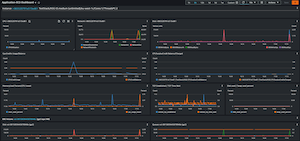
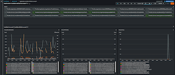
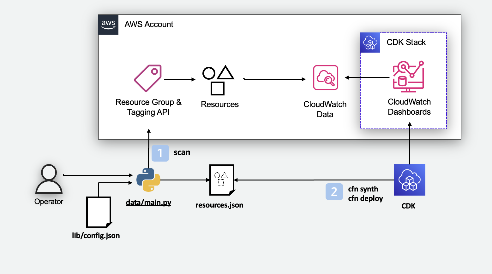
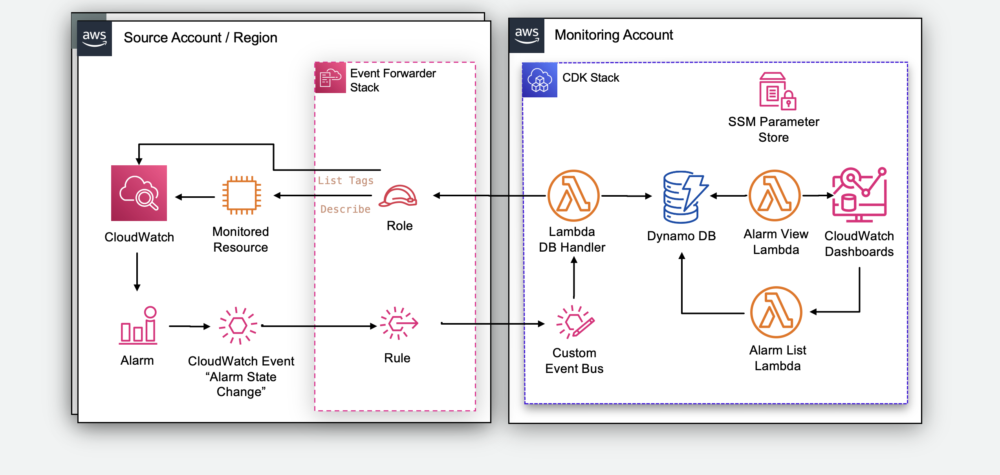
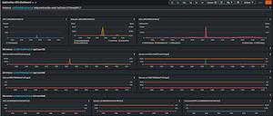
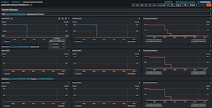
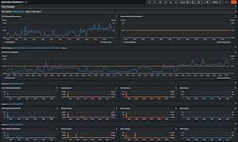

# Tag Based CloudWatch Dashboard using CDK

[](https://opensource.org/licenses/MIT)
[](https://docs.aws.amazon.com/AmazonCloudWatch/latest/monitoring/WhatIsCloudWatch.html)

The project is an example building a CloudWatch Dashboard. It provides users with a set of CloudWatch Dashboard with _reasonable_ metrics and alarms. It gets the list of AWS resources with a specific Tag using AWS Resource Groups Tagging API. Optionally it provides a Central Alarm Dashboard to monitor Alarms across an AWS Organization, AWS Organization OU or across arbitrary number of AWS accounts.

  [](screenshots/EC2-burstable-instance.png)  [](screenshots/LambdaCompact.png)


## Features
### 1. Metric dashboards
- Discovers AWS resources based on Tags.
- Generates a set of CloudWatch Dashboards for AWS Resources. Dashboards are specifically designed to monitor the most important operational metrics.
- Can build CloudWatch Dashboards for resources in other accounts if CloudWatch cross-account observability is enabled.

### 2. Alarm dashboard
- Event-driven for scalability and speed
- Supports arbitrary source accounts within an AWS Organization (different teams can have own dashboards)
- Supports automatic source account configuration through stack-sets
- Supports visualization and sorting of alarm priority (CRITICAL, MEDIUM, LOW) through alarm tags in source accounts. Simply add tag with key `priority` and values critical, medium or low.
- Supports tag data for EC2 instances in source accounts

## How it works

### Metric dashboards
1. A python tool `data/main.py` is used to retrieve a list of resources using Resource Groups Tagging API and to generate the configuration file.
2. CDK is used to generate CloudFormation template and deploy it

  

For MultiAccount use cases this [diagram](screenshots/Architecture-Dashboards-MultiAccount.png).


### Central Alarm Dashboard
When a CloudWatch Alarm changes state (going from OK to ALARM state), an event is emitted to EventBridge in the account. An event bus rule forwards the event to the central event bus in the monitoring account. This event is then registered in DynamoDB. CloudWatch custom widgets visualize current alarm state on the dashboard.

  


## Prerequisites
- Python3
- NodeJS 16+, recommended 18LTS, (required by CDK v2)
- CDK v2 (Installation: `npm -g install aws-cdk@latest`)

## Installation and Run deployment of CloudWatch Dashboards

1. Check out the project, install dependencies and initiate CDK
```bash
git checkout git@github.com:aws-samples/tag-based-cloudwatch-dashboard.git
cd tag-based-cloudwatch-dashboard
pip3 install -r requirements.txt
npm ic
cdk bootstrap
```
2. Run
```bash
python3 data/main.py
```
The tool will read existing configuration file, the read resources from your AWS Account in given regions and generate for all resources with a given Tag a CloudWatch Dashboards. You can fine tune Dashboards using Configuration File and repeating the command above.

3. Explore Dashboards in your CloudWatch console https://console.aws.amazon.com/cloudwatch/home?#dashboards/

## Enabling Alarms Feature
Enabling of alarms feature requires modifications on 2 accounts: source account and destination account.

1. In addition to CloudWatch Dashboards dashboards deployment, modify in `lib/config.json` by setting `AlarmDashboard.enabled` to `True` and provide your AWS-Organizations id in `AlarmDashboard.organizationId` (o-xxxxx, not ou-xxxx). Then update dashboards using the tool:
```bash
python3 data/main.py
```
Once CDK deploy is done, identify in the output of the Stack `AlarmDashboardStack` value of output `eventBusArn` and `CustomDynamoDBFunctionRoleArn`. 

2. Deploy [`event_forwarder.yaml`](/stack_sets/event_forwarder_template.yaml) template manually to each of the source accounts and each region you wish to enable through CloudFormation or deploy it automatically to an AWS Organization, OU or list of accounts through service managed StackSets from your management account or StackSet delegate account. Use `eventBusArn` and `CustomDynamoDBFunctionRoleArn` as parameters of the Stack/StackSets.

If you are using StackSets please note that StackSets are not deploying Stacks in the Management Account. If you want Alerts from Management account you will need additionally to deploy [`event_forwarder.yaml`](/stack_sets/event_forwarder_template.yaml) in all relevant regions of your Management Account.

## Advanced configuration
You can fine tune configuration of dashboards in by editing a configuration file `lib/config.json`

* `BaseName` (String:required) - Base-name of your dashboards. This will be the prefix of the dashboard names.
* `ResourceFile` (String:required) - The path for the file where resources are stored. Used by the `resource_collector.py` when generating resource config and by the CDK when generating the CF template.
* `TagKey` (String:required) - Configuration of the tag key that will select resources to be included.
* `TagValues` (Array<String>:required) - List of values of `TagKey` to include.
* `Regions` (Array<String>:required) - List of regions from which resources are displayed.
* `GroupingTagKey` (String:optional) - If set, separate Lambda and EC2 dashboards will be created for every value of that tag. Every value groups resources by that value.
* `CustomEC2TagKeys` (Array<String>:optional) - If set, the tag info will show in the EC2 header widget in format Key:Value. Useful to add auxilary information to the header.
* `CustomNamepsaceFile` (String:required) - Detected custom namespaces. Not yet used.
* `Compact` (boolean (true/false):required) - When set to true, multiple Lambda functions will be put in a single widget set. Useful when there are many Lambda functions.
* `CompactMaxResourcesPerWidget` (Integer:required) - When `Compact` is set to true, determines how many Lambda functions will be in each widget set.
* `AlarmTopic` (String:optional) - When `AlarmTopic` contains a string with an ARN to a SNS topic, all alarms will be created with an action to send notification to that SNS topic.
* `AlarmDashboard.enabled` (boolean (true/false):optional) - When set to true deploys the alarm dashboard in the account.
* `AlarmDashboard.organizationId` (String: required when `AlarmDashboard.enabled` is true) - Required in order to set resource policy on the custom event bus to allow PutEvents from the AWS Organization.
* `MetricDashboards.enabled` (boolean (true/false):optional) - If not defined or set to true, deploy metric dashboards. Recommended if only alarm dashboard is being deployed.


## Screenshots

> Click on the thumbnails to see the full res screenshot

> Note that all blue labels in the headers (text widgets) are links that will take you to the respective resource in the console for quick access.

### Lambda in "compact" mode

- Number of Lambda functions per widget is controlled through `CompactMaxResourcesPerWidget` parameter in `lib/config.json`

  [](screenshots/LambdaCompact.png)

### EC2 Instance

- Individual EBS volumes are presented with additional volume information (type and IOPS)
- PIO volumes are presented with additional metrics

  [](screenshots/EC2-instance.png)

### Burstable EC2 Instance with CloudWatch agent configured

- Burstable instances are presented with additional burstmode information
- Additional metrics to keep track of CPU-credits usage are shown
- If CloudWatch agent is configured then the widgets are shown automatically

  [](screenshots/EC2-burstable-instance.png)

### Network dashboard - TGW view

- Metrics are shown on TGW and on attachment level
- Type of attachment is shown

  [](screenshots/Network-TGW.png)

### ECS with EC2 service

- Cluster level and service level metrics are shown separately
- If service is EC2-type then high level metrics for EC2 instances are shown

  [](screenshots/ECS-EC2-service.png)


## Supported services
- Amazon API Gateway v1 (REST)
- Amazon API Gateway v2 (HTTP, WebSockets)
- AWS AppSync
- Amazon Aurora
- Auto Scaling groups
- On-Demand Capacity Reservations
- Amazon CloudFront
- Amazon DynamoDB
- Amazon EBS (as part of EC2)
- Amazon EC2 (support for t\* burstable instances, support for CloudWatch Agent)
- ELB v1 (ELB Classic)
- ELB v2 (ALB, NLB)
- Amazon ECS (EC2 and Fargate)
- Amazon EFS
- AWS Lambda
- AWS Elemental MediaLive
- AWS Elemental MediaPackage
- NAT Gateway
- RDS
- S3
- SNS
- SQS
- Transit Gateway
- AWS WAFv2

## Tips
You can setting up a CodeCommit repository where you store your code. Set up a CI/CD pipeline to automatically redeploy your dashboard.
This way, if you want to change/add/remove any metrics for any of the services you change the code, commit it, and it will be automatically deployed.

You can also create an EventBridge rule that will listen to specific tag change and trigger the CodeBuild project to redeploy the dashboard.
This way, if you have an autoscaling group or just tag additional resources the dashboard will deploy automatically. In case you do so, monitor your builds
to avoid rare situations where a lot of tag changes could cause excessive amounts of concurrent or queued builds (for example event bridge rule misconfiguration or
variable loads that causes ASG to scale up and down quickly). This can be done by specifying tag value in the Event Bridge rule or instead of triggering the build
directly from Event Bridge sending it to a Lambda function for more flexible decision-making on whether to trigger a build or not.

## Developing
[Developing](DEVELOPING.md)
